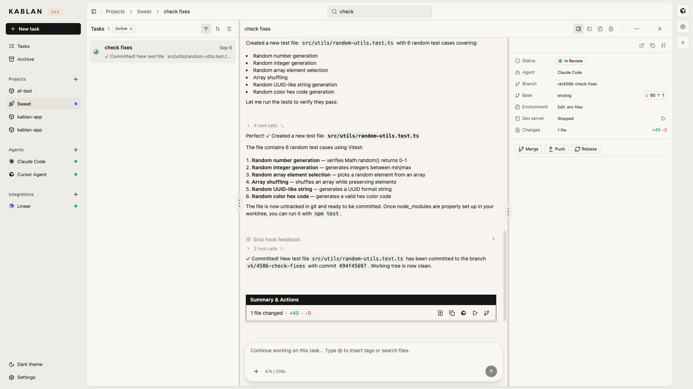
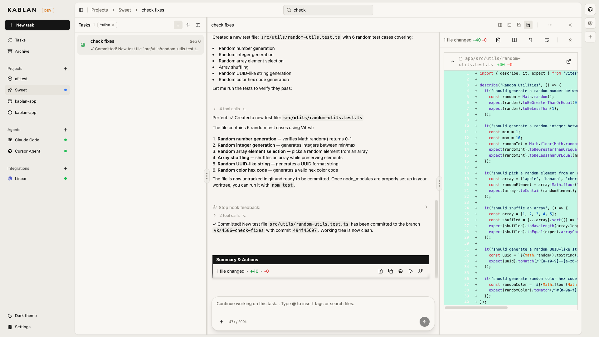
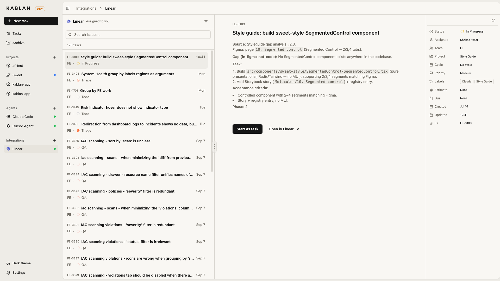

# Kablan

Come in, start a task, and let the coding agent you already pay for — Claude Code, Codex,
Gemini, Cursor, and others — work against your own repositories.

Each task gets its own git worktree and its own branch, so several agents can run at once
without standing on each other. You follow the conversation, review the diff, start the
project's dev server, and merge or open a PR when it looks right.

<p align="center">
  
</p>

Kablan is a fork of [Vibe Kanban](https://github.com/BloopAI/vibe-kanban) by Bloop AI, Apache-2.0.
See [NOTICE](NOTICE) for what this fork changes.

## What you get

- **A worktree per task.** Every attempt is checked out onto its own branch. Agents never share
  a working copy, so one rewriting a file cannot break another mid-edit.
- **The agent you already pay for.** Kablan launches each agent's own CLI — Claude Code, Codex,
  Gemini, Amp, OpenCode, Cursor Agent, Copilot, Qwen, Droid, Claude Code Router — so
  authentication, models and limits stay whatever you have configured. Switch between them per
  task.
- **A three-column task view.** Tasks and what they are doing on the left, the conversation in
  the middle, the attempt — branch, worktree, dev server, diffs, merge and PR — on the right.
- **Attempts, not one shot.** Unhappy with a run? Start another attempt on a fresh branch and
  compare. The earlier one stays exactly where it was.
- **Run it before you merge.** Start the project's dev server from the task, edit `.env` files,
  read the logs, and open it in a real browser.
- **Review in place.** Line-by-line diffs, comments back to the agent, then merge, rebase, push
  or open a GitHub pull request — with the ahead/behind count in view.
- **Board or list, one project or all of them.** A kanban board when you want columns; a dense
  list when there is too much on. The Tasks view looks across every project.
- **Tickets to tasks.** Connect Linear and start any issue assigned to you as a Kablan task,
  without leaving the board.
- **Tools for the agent.** One-click MCP servers — Playwright, Exa, Context7, Chrome DevTools,
  Headroom, Dev Manager, and Kablan itself — so the agent can browse, search, and create more
  tasks.
- **The rest of the work.** Subtasks, reusable `@` tags, search, keyboard shortcuts, Open in
  IDE (including a remote SSH worktree), light and dark themes. No account, and nothing phones
  home.

<p align="center">
  
</p>

<p align="center">
  
</p>

## Install

```bash
npx kablan
```

Nothing to install: the wrapper downloads the binary for your platform from this repository's
latest release, caches it under `~/.kablan/bin`, and runs it. Kablan opens in your browser.

### As a Mac app

```bash
npx kablan --install
```

Puts `Kablan.app` in `~/Applications`. Opening it starts Kablan in the background — no terminal
window — and opens your browser; output goes to `~/Library/Logs/Kablan/kablan.log`.

Because the bundle is assembled on your machine rather than downloaded, macOS does not quarantine
it, so there is no "unidentified developer" prompt and nothing to notarise.

Update with `npx kablan@latest --install`, remove with `npx kablan --uninstall`.

Authenticate with your coding agent of choice first — Kablan drives the agent's own CLI, it does
not hold your model credentials.

## Development

### Prerequisites

- [Rust](https://rustup.rs/) (the toolchain in `rust-toolchain.toml`)
- [Node.js](https://nodejs.org/) >= 18
- [pnpm](https://pnpm.io/) >= 8

```bash
cargo install cargo-watch
cargo install sqlx-cli --version ^0.8   # 0.9 needs a newer rustc than this repo pins
pnpm i
```

### Running it

```bash
pnpm run dev
```

Frontend on **5310**, backend on **5311**. A blank database is copied from `dev_assets_seed` on
first run.

To run the two halves separately — useful when you want the backend to survive a frontend restart:

```bash
BACKEND_PORT=5311 pnpm run frontend:dev
```

### Database

Queries are checked at compile time against the `.sqlx` cache. After changing any SQL:

```bash
pnpm run prepare-db
```

### Building

```bash
cd frontend && pnpm build     # frontend only
./local-build.sh              # binaries + npx package (macOS)
cd npx-cli && node bin/cli.js # try the packaged build
```

## Environment variables

| Variable | When | Default | What it does |
|---|---|---|---|
| `PORT` | runtime | auto | Production: server port. Dev: frontend port, backend takes `PORT+1` |
| `FRONTEND_PORT` | runtime | `5310` | Frontend dev server port |
| `BACKEND_PORT` | runtime | `5311` | Backend port in dev; also what the frontend proxies to |
| `HOST` | runtime | `127.0.0.1` | Backend host |
| `MCP_HOST` / `MCP_PORT` | runtime | follows `HOST` / `BACKEND_PORT` | Where the MCP task server connects |
| `DISABLE_WORKTREE_CLEANUP` | runtime | unset | Leave orphaned and expired worktrees alone, for debugging |
| `VK_ALLOWED_ORIGINS` | runtime | unset | Comma-separated origins allowed to call the API |
| `KABLAN_SENTRY_DSN` | runtime | unset | Crash reporting. Nothing is sent unless you set this |
| `KABLAN_LOCAL` / `KABLAN_DEBUG` | runtime | unset | npx wrapper: use local binaries / verbose output |

Analytics are removed in this fork: `posthog-js` and `@sentry/react` are aliased to no-op modules
at build time, so nothing is sent from the frontend even if new code imports them.

### Behind a reverse proxy

Set `VK_ALLOWED_ORIGINS` to the origin the browser actually uses, or the backend rejects the
requests with 403:

```bash
VK_ALLOWED_ORIGINS=https://kablan.example.com
```

### Running on a remote server

Configure **Settings → Editor Integration** with your SSH host and user, and "Open in IDE" will
produce `vscode://vscode-remote/ssh-remote+user@host/path` URLs that open your local editor
against the remote worktree. You need passwordless SSH and the Remote-SSH extension.
